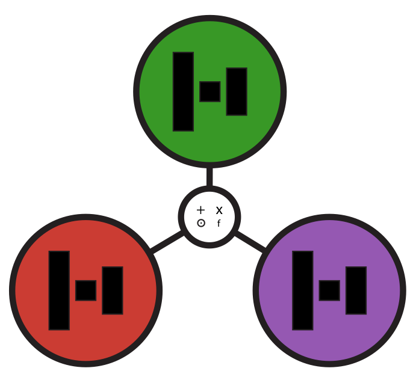

 
# LowRankArithmetic.jl &emsp;

LowRankArithmetic.jl facilitates the propagation of low rank factorizations through the compositions of many common linear algebra operations such as
* matrix-matrix/vector multiplication
* addition
* Hadamard products
* elementwise integer powers
* concatenation & slicing

Two types of low-rank representations are supported:

1. Two-factor representation:

&emsp;&emsp;&emsp;&emsp;&emsp; where 

 
2.  SVD-like representation:

&emsp;&emsp;&emsp;&emsp;&emsp; where 

Note, however, that $U$ and $V$ need not be orthogonal, nor are $S$ and $Z$ required to be diagonal or upper triangular as may be familiar from the QR or SVD factorizations. In particular, these properties are not maintained when a QR or SVD factorization is propagated through different arithmetic operations. 

LowRankArithmetic.jl further supports efficient & robust svd-based rounding procedures to reduce the rank of a given low rank factorization. Also efficient Gram-Schmidt-, QR-, SVD-, and gradient flow-based reorthonormalization procedures for the $U$ and $V$ factors are available. 

